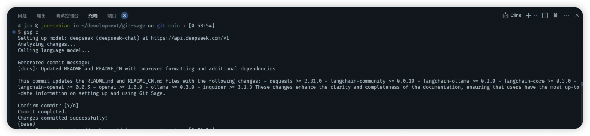

# Git Sage

Git Sage 是一个 AI 驱动的 Git 助手，它可以帮助你生成更好的提交信息。



## 功能特点

- 自动分析已暂存的更改
- 使用 AI 生成规范的提交信息
- 支持中英文提交信息
- 支持自定义 AI 模型配置
- 简单易用的命令行界面

## 安装

```bash
# 克隆仓库
git clone https://github.com/yourusername/git-sage.git

# 进入项目目录
cd git-sage

# 安装
pip install -e .

# 配置Git Sage
gsg set
```

## 平台

Git Sage 支持多个 AI 平台来驱动其提交信息生成功能。以下是各平台的设置和使用方法：

### Ollama（本地）

- 下载：访问 [Ollama 官网](https://ollama.ai) 下载并安装
- 设置：

  ```bash
  # 拉取推荐模型
  ollama pull qwen2.5-coder:7b

  # 启动Ollama服务
  ollama serve
  ```

- 配置：
  ```bash
  gsg set
  # 将language_model设置为：ollama
  # 将endpoint设置为：http://localhost:11434
  # 将model设置为：qwen2.5-coder:7b
  # API密钥可保持默认
  ```

### OpenRouter

- 注册：在 [OpenRouter](https://openrouter.ai) 注册账号
- API 密钥：从账户控制面板生成
- 配置：
  ```bash
  gsg set
  # 将language_model设置为：openrouter
  # 将model设置为：anthropic/claude-3-sonnet
  # 在提示时输入你的API密钥
  ```

### DeepSeek

- 注册：访问 [DeepSeek](https://platform.deepseek.com)
- API 密钥：从账户设置生成
- 配置：
  ```bash
  gsg set
  # 将language_model设置为：deepseek
  # 将endpoint设置为：https://api.deepseek.com/v1
  # 将model设置为：deepseek-chat
  # 在提示时输入你的API密钥
  ```

## 配置

配置 Git Sage 设置：

```bash
# 通过交互模式进行配置
gsg set

# 查看当前配置
gsg show config
```

配置向导将引导你设置：

- 响应语言
- 语言模型服务
- 模型名称
- 服务端点
- API 密钥

## 使用方法

生成提交信息：

```bash
# 首先使用git add暂存你的更改
git add [files]

# 然后使用gsg生成提交信息并提交
gsg c
```

## 提交信息规范

提交信息遵循 Conventional Commit 规范，格式如下：

```
{标签}: 变更的主题或标题
可选的详细描述
```

### 提交标签说明

#### 补丁版本 (PATCH)

以下标签会产生补丁版本更新：

- `Fix`: 用于修复 bug
- `Build`: 仅构建过程的变更
- `Maint`/`Maintenance`: 小型维护任务，如技术债务清理、重构、构建过程变更和非破坏性依赖更新
- `Test`: 用于应用程序端到端测试
- `Patch`: 当其他补丁标签不适用时使用的通用补丁标签

#### 次要版本 (MINOR)

以下标签会产生次要版本更新：

- `Feat`/`Feature`/`New`: 实现新功能
- `Minor`: 当其他次要版本标签不适用时使用的通用标签
- `Update`: 对现有功能的向后兼容增强

#### 主要版本 (MAJOR)

以下标签会产生主要版本更新：

- `Breaking`: 用于向后不兼容的增强或功能
- `Major`: 当其他主要版本标签不适用时使用的通用标签

#### 无版本更新 (NO-OP)

以下标签不会触发版本更新：

- `Docs`: 仅文档变更
- `Chore`: 用于其他不会影响实际环境的变更，如代码注释、非包或应用程序文件的变更、单元测试等

## 配置说明

配置文件位于 `~/.git-sage/config.yml`，包含以下配置项：

- language: 提交信息语言 (默认为 en)
- language_model: 选择使用的语言模型服务 (默认为 ollama)
- model: 选择具体的模型名称 (默认为 codellama)
- endpoint: 模型服务地址 (默认为 http://localhost:11434)
- api_key: API 密钥 (默认为 ollama)

你可以使用 `gsg show config` 查看当前配置，通过 `gsg set` 修改设置。

## 依赖项

- Python >= 3.8
- langgraph >= 0.2.50
- gitpython >= 3.1.40
- click >= 8.1.7
- pyyaml >= 6.0.1
- requests >= 2.31.0
- langchain-community >= 0.0.10
- langchain-ollama >= 0.2.0
- langchain-core >= 0.3.0
- langchain-openai >= 0.0.5
- openai >= 1.0.0
- ollama >= 0.3.0
- inquirer >= 3.1.3

## 许可证

MIT License
